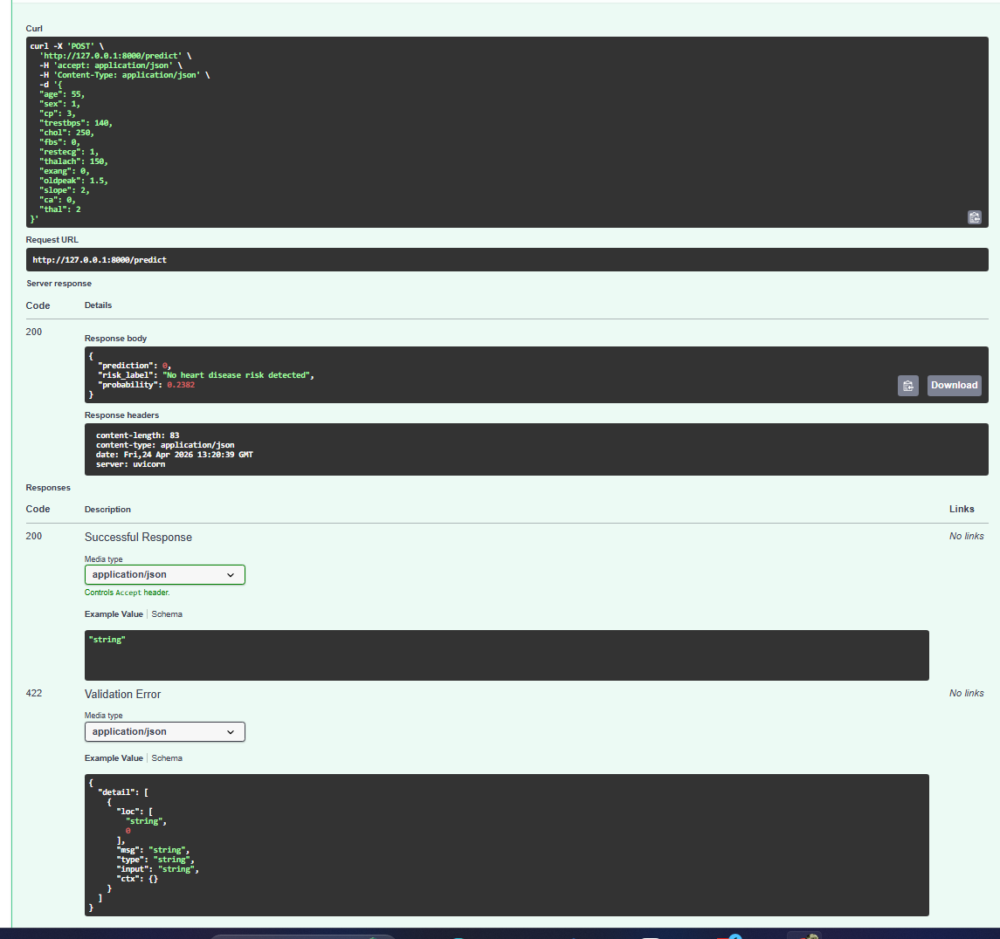

# Heart Disease ML API

This project deploys a machine learning model for heart disease prediction using FastAPI.
The model is based on the UCI Cleveland Heart Disease dataset and uses a scikit-learn pipeline to process patient features and return a prediction through an API endpoint.

## Project Goal

The goal of this project is to move a machine learning model beyond a Jupyter Notebook and turn it into a usable API. It demonstrates model training, preprocessing, serialization, and real-time prediction.

## Portfolio Value

This project shows how a machine learning model can be moved from a notebook-style workflow into a small usable API. It demonstrates basic ML productionization skills such as training a model in a script, saving the trained pipeline, validating structured input, and serving real-time predictions through an endpoint.

## Tools Used

- Python
- FastAPI
- scikit-learn
- pandas
- numpy
- joblib
- Uvicorn

## Features

- Trains a Logistic Regression model
- Saves the model pipeline as a `.pkl` file
- Provides a `/predict` endpoint
- Accepts 13 clinical input features
- Returns heart disease risk prediction and probability

## Project Structure

```text
heart-disease-ml-api/
├── app/
│   ├── main.py
│   ├── schemas.py
│   ├── train_model.py
│   └── model.pkl
├── screenshots/
│   └── predict_success.png
├── README.md
├── requirements.txt
└── .gitignore
```

## Model Performance

The Logistic Regression model was trained on the official UCI Cleveland Heart Disease dataset.

Evaluation results:
- **Accuracy:** 0.833
- **Recall:** 0.786
- **F1 Score:** 0.815
- **ROC AUC:** 0.950

## API Test

The `/predict` endpoint was tested successfully through the FastAPI Swagger UI and returned a `200 OK` response.

Example output:
```json
{
  "prediction": 0,
  "risk_label": "No heart disease risk detected",
  "probability": 0.2382
}
```

## Screenshot

The API was tested through FastAPI Swagger UI.



## How to Run

1. **Install dependencies:**
```bash
pip install -r requirements.txt
```

2. **Train and save the model:**
```bash
python app/train_model.py
```

3. **Run the API server:**
```bash
uvicorn app.main:app --reload
```

4. **Open the API documentation to test:**
Navigate to `http://127.0.0.1:8000/docs` in your web browser.

## Note

This project is for educational and portfolio purposes only. It is not intended for real medical diagnosis or clinical decision-making.
